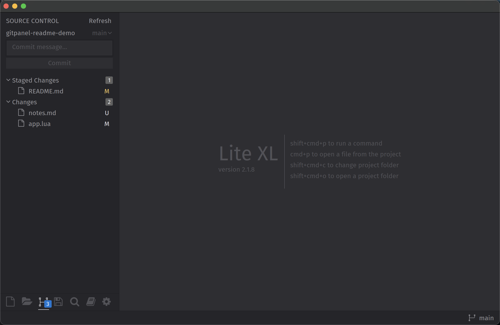
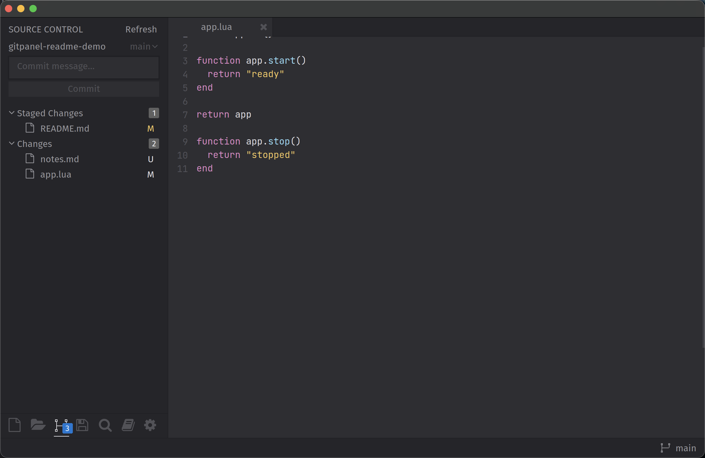
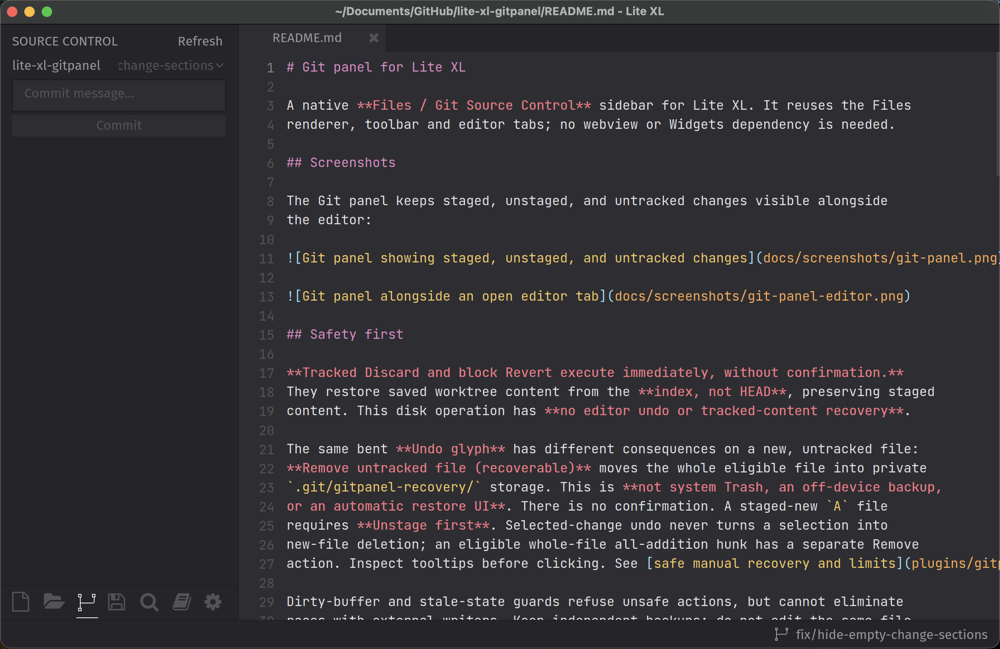

# Git panel for Lite XL

A native **Files / Git Source Control** sidebar for Lite XL. It reuses the Files
renderer, toolbar and editor tabs; no webview or Widgets dependency is needed.

## Screenshots

The Git panel keeps staged, unstaged, and untracked changes visible alongside
the editor:





Empty sections are omitted when the repository has no pending changes:



## Safety first

**Tracked Discard and block Revert execute immediately, without confirmation.**
They restore saved worktree content from the **index, not HEAD**, preserving staged
content. This disk operation has **no editor undo or tracked-content recovery**.

The same bent **Undo glyph** has different consequences on a new, untracked file:
**Remove untracked file (recoverable)** moves the whole eligible file into private
`.git/gitpanel-recovery/` storage. This is **not system Trash, an off-device backup,
or an automatic restore UI**. There is no confirmation. A staged-new `A` file
requires **Unstage first**. Selected-change undo never turns a selection into
new-file deletion; an eligible whole-file all-addition hunk has a separate Remove
action. Inspect tooltips before clicking. See [safe manual recovery and limits](plugins/gitpanel/README.md#safe-manual-recovery-no-overwrite).

Dirty-buffer and stale-state guards refuse unsafe actions, but cannot eliminate
races with external writers. Keep independent backups; do not edit the same file
with another tool during a destructive operation. Errors or timeouts can mean
partial completion: inspect disk, Git status and recovery entries before retrying.

## Requirements and support

- Lite XL with **mod-version 3 APIs** and enabled native `treeview`.
- **Git 2.25+** on the application's PATH (verified with Apple Git 2.50.1).
- Existing **Python 3.9+** on that PATH for tracked discard/revert and recoverable
  Remove. Missing Python refuses those actions; Git status/diff and ordinary
  whole-file stage/unstage remain available. No interpreter is downloaded.
- Runtime development/verification is on **macOS (Darwin)**. Linux coverage is
  limited to removal-helper contracts, not a verified Linux editor integration.
  Windows support is **not claimed**.

The latest snapshot has headless regression coverage, not fresh GUI appearance or
mouse-click acceptance. Experimental **block/selected-line stage and unstage are
disabled** (`staging.lua`: `ENABLED = false`). Publication does not enable them.

## Install manually

1. Obtain this repository in a separate checkout or extracted directory.
2. Quit Lite XL normally. If replacing a plugin, back up the existing
   `USERDIR/plugins/gitpanel` **outside `USERDIR/plugins`** first.
3. Copy **this repository's `plugins/gitpanel` subdirectory** into your Lite XL
   user directory's `plugins` directory. The final layout must be:

   ```text
   USERDIR/
     plugins/
       gitpanel/
         init.lua
         discard.py
         remove.py
         staging.py
         ...
   ```

   `USERDIR` means your Lite XL user directory (commonly `~/.config/lite-xl`).
   **Do not clone the whole repository into `USERDIR/plugins/gitpanel`:** that
   creates an extra `plugins/gitpanel` level and will not load correctly.
4. Start Lite XL normally. No app-bundle or configuration edits are required.

To disable, quit normally, move `gitpanel` outside `plugins`, then restart.
Do not hot-unload modules: the plugin installs application-lifetime hooks.
Nothing here automatically installs or restarts the editor.

## Everyday use

- Toggle **Files / Git** with the branch-shaped bottom toolbar icon or
  `Ctrl+Shift+G`. Files expansion/selection/scroll are retained. Compact text tabs
  are the fallback when the toolbar is hidden.
- Git shows the primary project's enclosing worktree: **Conflicts**, **Staged
  Changes**, and **Changes** (tracked plus untracked). Refresh with `Ctrl+Alt+R`.
  A resource badge counts a partially staged file in both groups.
- **+ / −** stage saved disk contents or unstage whole files, without a prompt.
  Group actions operate on listed paths. Global Stage All excludes conflicts;
  explicitly staging a conflict marks your disk version resolved, so inspect it
  first. Unsaved buffers are never implicitly saved.
- Click a row for a read-only side-by-side comparison: staged is **HEAD → index**,
  tracked changes **index → saved disk**, untracked **empty → saved disk**.
  Navigate blocks, select/copy exact text, or open a raw patch fallback.
- Compose a multiline message and **Commit staged content only** (`Ctrl+Return`
  when the Git sidebar/composer is focused). There is no implicit staging or push.
  Failed commits retain the draft; successful commits clear it only if unchanged.
  Drafts are in memory, not retained after application exit.
- Click the branch indicator or use `Ctrl+Alt+B` to search local/known remote
  refs. Switch/create local branches only with clean Git state and no unsaved
  buffers. Remote refs are informational; nothing is fetched or auto-stashed.
- Errors have copyable read-only details. Reopen stale comparisons explicitly.

More: [usage, recovery and safety](plugins/gitpanel/README.md),
[feature boundaries](FEATURES.md), [testing](TESTING.md).

## License

[MIT](LICENSE), copyright 2026 rajan-personal, for this plugin's source.
[Lite XL](https://github.com/lite-xl/lite-xl) and [Git](https://git-scm.com/) are
separate dependencies, not bundled or covered by this project's ownership claim.
