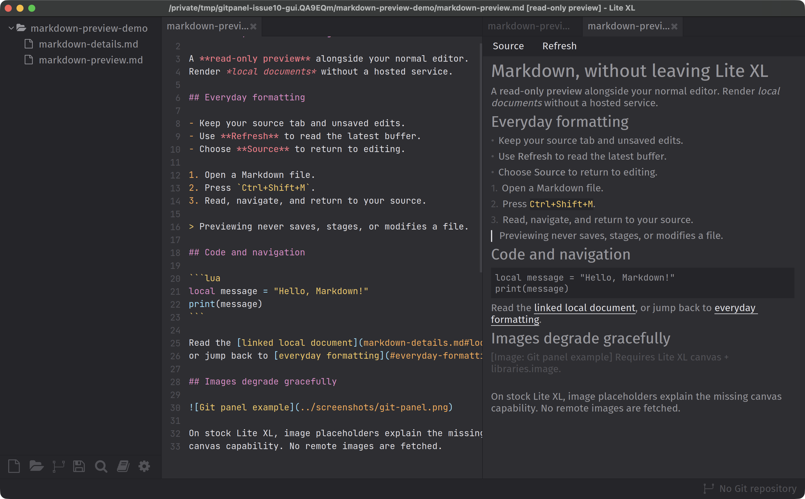
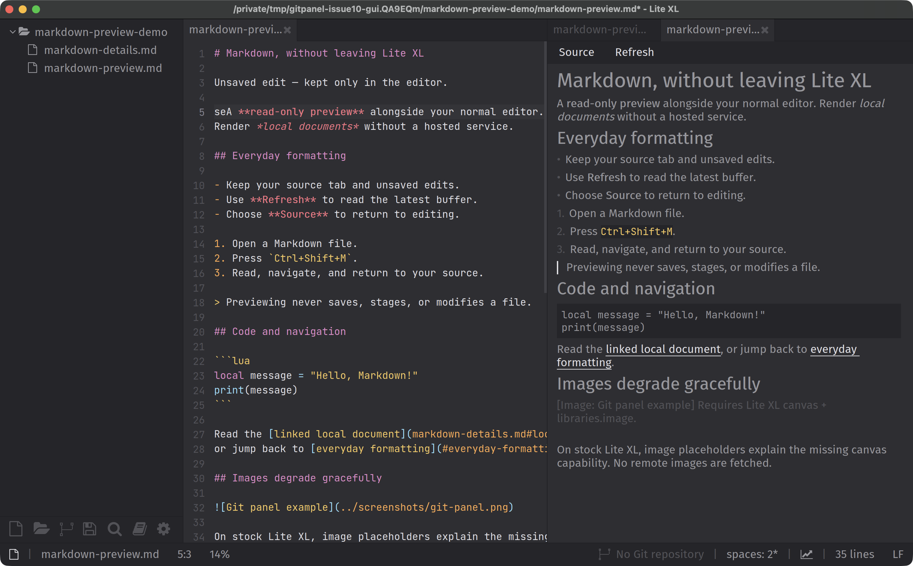

# Markdown viewer: design reference and unresolved image support

## Status: prototype, not acceptance-complete

PR #12 supplies a read-only native text-preview foundation. The owner clarified
that the viewer should follow **Orca's rich Markdown design language** and must
actually display images. Placeholders are an error/fallback state, **not a
substitute for implementing image viewing**. Passing headless tests does not
establish either visual parity or complete issue #10 acceptance.

## Orca reference inspected

The currently visible Orca rich Markdown editor was inspected through a real
window screenshot. Observations to carry into the Lite XL design:

- A quiet, dark document canvas with bright, readable body text.
- Clear reading hierarchy, deliberate paragraph spacing and consistent list
  indentation rather than a densely packed editor-like presentation.
- Compact controls separated from the reading surface; subtle chrome and borders.
- A visible source/rich-text mode distinction and formatting controls, including
  an image action.

The screenshot contained the owner's unrelated notes, so it is **not published**
in this public repository. It did not contain an actual rendered image or all
Markdown constructs, and it was not independently confirmed to be a specific
orchestrator subview. Image sizing, galleries/zoom, tables and code-block styling
must still be inspected in an appropriate reference example. These observations
are a starting point, not a pixel-perfect specification or a claim of parity.

For this read-only feature, adopt the visual language without misleadingly copying
an editing toolbar whose controls the preview does not implement. Source editing
must remain in the normal Lite XL editor. The current prototype still needs
contrast, spacing, readable-width and toolbar/layout review against that reference.

## Why image viewing needs a separate feasibility step

The installed and latest released Lite XL **2.1.8 / mod-version 3** exposes text
and rectangle drawing, not an image/canvas blit API. The upstream master renderer
API inspected during this review also exports `draw_text` and `draw_rect`, not
`draw_canvas`:

- [Lite XL v2.1.8](https://github.com/lite-xl/lite-xl/releases/tag/v2.1.8)
- [Upstream renderer API](https://github.com/lite-xl/lite-xl/blob/master/src/api/renderer.c)
- [lite-xl-image](https://github.com/adamharrison/lite-xl-image) supplies an existing
  decoder intended for a canvas-enabled Lite XL 3.0 build; its `imagepreview`
  manifest targets **mod-version 4**. Installing the decoder alone does not add
  a compatible drawing surface to stable Lite XL.

PR #12's optional image bridge is mock-tested only. It has not rendered an actual
image on a compatible native build. No existing drop-in stable Lite XL webview
integration was found in the searches performed; that is not proof none exists.

### Options to investigate, not implementation promises

1. **Native image backend:** evaluate a compatible canvas-enabled build or a
   minimal upstreamable image/canvas extension/backport. Prove real image decode,
   drawing, scaling and clipping on the target macOS build before claiming
   support. Determine whether a native plugin suffices or a core change is needed;
   do not assume the decoder solves rendering. Packaging, ABI compatibility and
   other platforms remain explicit costs.
2. **Embedded local webview:** investigate an existing maintained native webview
   library plus a local Markdown renderer. This may offer richer Markdown/image
   layout, but it still needs Lite XL integration, focus/scroll/resize handling,
   platform packaging and safe local-resource access. It is not a plain Lua styling
   change. No webview or native binaries have been installed into the user's editor.
3. **Offline external-browser preview:** technically a simpler route to real
   Markdown/images with existing tools, but it is a separate fallback mode and
   **does not satisfy the in-editor requirement**. Do not silently change the
   requirement to fit this option.

Next milestone: choose a supported runtime/packaging boundary, then complete a
small real-image spike before expanding or polishing the current native renderer.

## Evidence collected so far

- `python3 -B plugins/gitpanel/tests/run.py`: **19 suites passed**, including
  **56 Markdown checks**, on the PR branch based on `main`.
- The installed optional SCM reload integration was skipped because its plugin
  was unavailable.
- Actual Lite XL 2.1.8 rendered the PR's plugin in an isolated `LITE_USERDIR`, with
  disposable Markdown fixtures and real fonts/renderer. The normal user profile
  and existing editor session were not modified.
- A native QA driver invoked registered split/preview commands and the source
  text-input handler. Screenshots visibly show native rendering, a separate source
  pane, an unsaved source edit, and an unchanged preview snapshot.
- Both fixture Markdown files remained byte-identical on disk (SHA-256 compared
  before/after). This does not prove visual fidelity or image support.
- Desktop automation could capture these windows but reported no on-screen window
  for input actions. Consequently **OS-level shortcut/mouse click-through was not
  verified**. Source/Refresh/link command logic remains covered by the automated
  native-core tests; do not describe those as manual GUI clicks.

The screenshots below are **baseline prototype evidence**, not an approved Orca
match or proof that images render. The image placeholder is an unresolved gap.

### Source and rendered preview

### Unsaved source with an unchanged preview snapshot

The source examples are in [`examples/`](examples/markdown-preview.md). Screenshots
are actual, uncomposited Lite XL window captures; they are not browser mockups.

## Before issue #10 can be considered complete

- [ ] Confirm the intended Orca view using a representative Markdown document
  containing headings, emphasis, lists, quotes, code, tables and actual images.
- [ ] Demonstrate real inline local PNG/JPEG rendering on the supported runtime,
  resolving relative/encoded paths, preserving aspect ratio and fitting the pane.
- [ ] Verify resize, scroll/clipping, missing/corrupt/oversized images and safe
  resource handling. Keep remote fetching explicit rather than automatic.
- [ ] Apply the agreed Orca-inspired typography, contrast, spacing and controls.
- [ ] Verify source/refresh/navigation through real desktop input and check that
  previewing/edit switching never auto-saves or discards user edits.
- [ ] Add final screenshots including a successfully rendered image, not only the
  current placeholder, and obtain visual acceptance.
